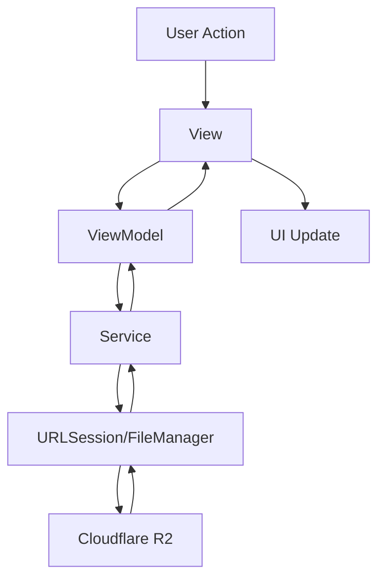

## Architecture Pattern

r2Vault follows a modern **MVVM (Model-View-ViewModel)** architecture using Swift 6's `@Observable` macro for reactive state management.

### Key Architectural Principles

<CardGroup cols={2}>
  <Card title="Unidirectional Data Flow" icon="arrow-right">
    Views observe ViewModels, ViewModels coordinate Services, Services return data
  </Card>
  <Card title="Separation of Concerns" icon="layer-group">
    Models, Services, ViewModels, and Views are cleanly separated
  </Card>
  <Card title="Reactive UI" icon="bolt">
    SwiftUI views automatically update when observable state changes
  </Card>
  <Card title="Async/Await First" icon="clock">
    All network and file operations use structured concurrency
  </Card>
</CardGroup>

## MVVM Implementation

### Observable ViewModels

r2Vault uses Swift 6's `@Observable` macro for automatic change tracking:

```swift ViewModels/AppViewModel.swift
@Observable
final class AppViewModel {
    // Upload queue
    var uploadTasks: [FileUploadTask] = []
    
    // Browser state
    var currentPrefix: String = ""
    var browserObjects: [R2Object] = []
    var browserFolders: [R2Object] = []
    var isBrowsing = false
    var browserError: String?
    
    // Credentials
    var credentialsList: [R2Credentials] = []
    var selectedCredentialID: UUID?
    
    // UI state
    var showAlert = false
    var alertMessage: String?
}
```

<Info>
The `@Observable` macro eliminates the need for manual `@Published` properties and `ObservableObject` conformance, providing better performance and cleaner code.
</Info>

### SwiftUI + AppKit Hybrid

r2Vault combines SwiftUI for the main interface with AppKit for menu bar functionality:

```swift Services/MenuBarManager.swift
@MainActor
final class MenuBarManager: NSObject {
    private var statusItem: NSStatusItem!
    private var popover: NSPopover!
    private let viewModel: AppViewModel
    
    init(viewModel: AppViewModel) {
        self.viewModel = viewModel
        super.init()
        setupStatusItem()
        setupPopover()
    }
    
    private func setupStatusItem() {
        statusItem = NSStatusBar.system.statusItem(
            withLength: NSStatusItem.squareLength
        )
        if let button = statusItem.button {
            button.image = NSImage(
                systemSymbolName: "arrow.up.to.line.compact",
                accessibilityDescription: "R2 Vault"
            )
            button.action = #selector(togglePopover)
            button.target = self
        }
    }
}
```

<Note>
**Why the hybrid approach?**

SwiftUI's menu bar support is limited. Using `NSStatusItem` and `NSPopover` provides:
- Persistent menu bar icon
- Control over popover behavior (`.applicationDefined`)
- Better window management
</Note>

## Concurrency Model

### Structured Concurrency with async/await

All asynchronous operations use Swift's modern concurrency:

```swift ViewModels/AppViewModel.swift
func loadCurrentFolder() {
    guard let credentials else {
        browserError = "Please configure R2 credentials in Settings (⌘,)."
        return
    }
    isBrowsing = true
    browserError = nil
    Task {
        do {
            let result = try await R2BrowseService.listObjects(
                credentials: credentials,
                prefix: currentPrefix
            )
            browserObjects = result.objects
                .filter { !$0.key.hasSuffix("/") }
            browserFolders = result.folders
            isBrowsing = false
        } catch {
            browserError = error.localizedDescription
            isBrowsing = false
        }
    }
}
```

### Parallel Uploads with TaskGroup

Multiple files upload concurrently using `withTaskGroup`:

```swift ViewModels/AppViewModel.swift
private func uploadPendingTasks() async {
    guard let credentials else { return }
    
    let pending = uploadTasks.filter { $0.status == .pending }
    await withTaskGroup(of: Void.self) { group in
        for uploadTask in pending {
            let handle = Task {
                await self.uploadSingleFile(uploadTask, credentials: credentials)
            }
            await MainActor.run { uploadTask.uploadTask = handle }
            group.addTask {
                await handle.value
                await MainActor.run { uploadTask.uploadTask = nil }
            }
        }
    }
}
```

### Concurrent Deletion with TaskGroup

Bulk deletions happen in parallel:

```swift ViewModels/AppViewModel.swift
func deleteSelected() async {
    guard let credentials else { return }
    let toDelete = allBrowserItems.filter { selectedObjectIDs.contains($0.id) }
    selectedObjectIDs.removeAll()
    
    await withTaskGroup(of: Void.self) { group in
        for object in toDelete {
            group.addTask {
                do {
                    if object.isFolder {
                        try await self.deleteRecursive(
                            prefix: object.key, 
                            credentials: credentials
                        )
                    } else {
                        try? await R2BrowseService.deleteObject(
                            credentials: credentials, 
                            key: object.key
                        )
                    }
                } catch {}
            }
        }
    }
    loadCurrentFolder()
}
```

<Warning>
**Actor isolation**: Services are marked `nonisolated enum` to allow calling from any actor context. ViewModels run on `@MainActor` for UI updates.
</Warning>

## State Management

### Single Source of Truth

`AppViewModel` is the single source of truth, created once at app launch:

```swift FiaxeApp.swift
@main
struct R2VaultApp: App {
    @State private var viewModel: AppViewModel
    @State private var menuBarManager: MenuBarManager
    
    init() {
        let vm = AppViewModel()
        _viewModel = State(initialValue: vm)
        _menuBarManager = State(initialValue: MenuBarManager(viewModel: vm))
    }
    
    var body: some Scene {
        WindowGroup(id: "main") {
            ContentView()
                .environment(viewModel)
        }
        Settings {
            SettingsView()
                .environment(viewModel)
        }
    }
}
```

### Environment Injection

The view model flows down the view hierarchy via SwiftUI's environment:

```swift ContentView.swift
struct ContentView: View {
    @Environment(AppViewModel.self) private var viewModel
    
    var body: some View {
        @Bindable var viewModel = viewModel
        
        NavigationSplitView {
            sidebarContent
        } detail: {
            detailContent
        }
        .alert("Error", isPresented: $viewModel.showAlert) {
            Button("OK", role: .cancel) {}
        } message: {
            if let msg = viewModel.alertMessage { Text(msg) }
        }
    }
}
```

<Tip>
Use `@Bindable` to create two-way bindings with `@Observable` models in SwiftUI views.
</Tip>

### Per-Task Observable State

Each upload task is its own observable object:

```swift Models/UploadTask.swift
@Observable
final class FileUploadTask: Identifiable {
    let id: UUID
    let fileName: String
    let fileSize: Int64
    let fileURL: URL
    
    var progress: Double = 0  // 0.0 – 1.0
    var status: Status = .pending
    var errorMessage: String?
    var resultURL: URL?
    var uploadTask: Task<Void, Never>?
    
    enum Status: Sendable {
        case pending, uploading, completed, failed, cancelled
    }
    
    func cancel() {
        uploadTask?.cancel()
        status = .cancelled
    }
}
```

## Data Flow



### Example: File Upload Flow

1. **User drops files** → `ContentView` calls `viewModel.handleDroppedURLs()`
2. **ViewModel creates tasks** → Builds `FileUploadTask` objects, adds to queue
3. **ViewModel spawns upload** → Calls `uploadPendingTasks()` with TaskGroup
4. **Service performs upload** → `R2UploadService.upload()` signs request, uploads via URLSession
5. **Progress updates** → Delegate calls `@MainActor` closure, updates task progress
6. **View reacts** → SwiftUI observes task changes, updates progress bar
7. **Completion** → Task status changes to `.completed`, view shows success

## Thread Safety

### MainActor for UI

All view models and UI state run on the main actor:

```swift
@Observable  // Implicitly @MainActor
final class AppViewModel {
    var uploadTasks: [FileUploadTask] = []
}
```

### Actor for Caching

The thumbnail cache is an actor for safe concurrent access:

```swift Services/ThumbnailCache.swift
actor ThumbnailCache {
    static let shared = ThumbnailCache()
    
    private let memoryCache = NSCache<NSString, NSImage>()
    private var inFlight: [String: Task<NSImage?, Never>] = [:]
    
    func thumbnail(for key: String, credentials: R2Credentials) async -> NSImage? {
        // Safe concurrent access to cache
        if let img = memoryCache.object(forKey: key as NSString) { return img }
        // Coalesce duplicate requests
        if let task = inFlight[key] { return await task.value }
        // ...
    }
}
```

### Sendable Types

All data types crossing actor boundaries are `Sendable`:

```swift Models/R2Credentials.swift
struct R2Credentials: Sendable, Codable, Equatable, Identifiable {
    var id: UUID
    var accountId: String
    var accessKeyId: String
    var secretAccessKey: String
    var bucketName: String
}
```

## Next Steps

<CardGroup cols={2}>
  <Card title="Project Structure" icon="folder-tree" href="/dev/project-structure">
    Explore the directory layout and module organization
  </Card>
  <Card title="Tech Stack" icon="layer-group" href="/dev/tech-stack">
    Learn about the frameworks and dependencies used
  </Card>
</CardGroup>
