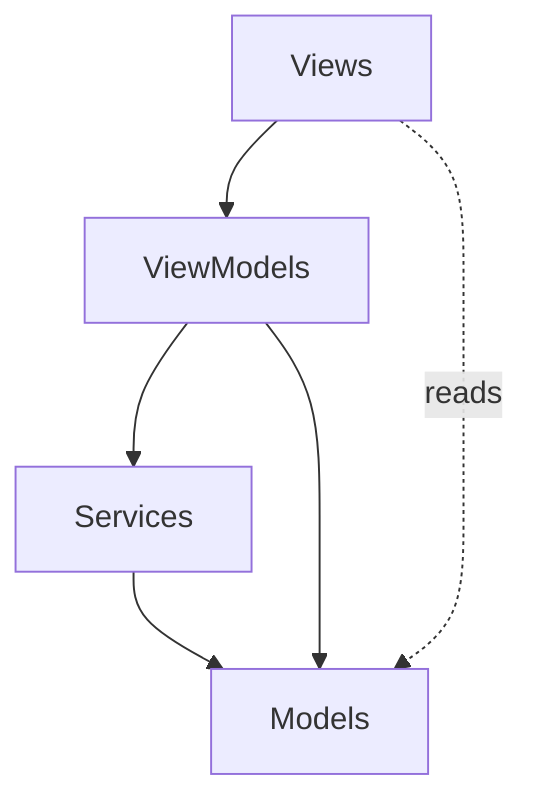

## Overview

r2Vault is a ~4,700 line Swift codebase organized into a clean, modular structure following MVVM principles.

```
Fiaxe/
├── FiaxeApp.swift          # App entry point, scene configuration
├── ContentView.swift        # Main navigation & layout
├── Models/                  # Data structures
│   ├── R2Credentials.swift
│   ├── R2Object.swift
│   ├── UploadItem.swift
│   └── UploadTask.swift
├── Services/                # Business logic & external APIs
│   ├── AWSV4Signer.swift
│   ├── AppUpdater.swift
│   ├── KeychainService.swift
│   ├── MenuBarManager.swift
│   ├── QuickLookCoordinator.swift
│   ├── R2BrowseService.swift
│   ├── R2UploadService.swift
│   ├── ThumbnailCache.swift
│   ├── UpdateService.swift
│   └── UploadHistoryStore.swift
├── ViewModels/              # State management
│   └── AppViewModel.swift
└── Views/                   # SwiftUI views
    ├── BreadcrumbView.swift
    ├── BrowserView.swift
    ├── HistoryRowView.swift
    ├── MenuBarView.swift
    ├── R2ObjectRow.swift
    ├── SettingsView.swift
    ├── ThumbnailView.swift
    ├── UpdateSheetView.swift
    ├── UploadHUDView.swift
    ├── UploadHistoryView.swift
    ├── UploadQueueView.swift
    └── UploadRowView.swift
```

## Application Entry Point

### FiaxeApp.swift

The main app structure that:
- Creates the single `AppViewModel` instance
- Initializes the menu bar manager
- Configures the main window and settings
- Sets up app-level commands (About, Check for Updates)

```swift FiaxeApp.swift
@main
struct R2VaultApp: App {
    @NSApplicationDelegateAdaptor(AppDelegate.self) var appDelegate
    @State private var viewModel: AppViewModel
    @State private var menuBarManager: MenuBarManager
    
    init() {
        let vm = AppViewModel()
        _viewModel = State(initialValue: vm)
        _menuBarManager = State(initialValue: MenuBarManager(viewModel: vm))
    }
    
    var body: some Scene {
        WindowGroup(id: "main") {
            ContentView()
                .environment(viewModel)
        }
        .defaultSize(width: 800, height: 560)
        .windowResizability(.contentMinSize)
        
        Settings {
            SettingsView()
                .environment(viewModel)
        }
    }
}
```

<Info>
**Menu bar-only app**: The `AppDelegate` prevents the app from quitting when the window closes, and `LSUIElement = YES` in Info.plist keeps it out of the Dock.
</Info>

### ContentView.swift

The root view that provides:
- Sidebar navigation (Buckets, History, Settings)
- Main content area with detail views
- Upload HUD overlay
- File importer sheets
- Error alerts

## Models Layer

### R2Credentials.swift

Encapsulates all information needed to connect to an R2 bucket:

```swift Models/R2Credentials.swift
struct R2Credentials: Sendable, Codable, Equatable, Identifiable {
    var id: UUID
    var accountId: String
    var accessKeyId: String
    var secretAccessKey: String
    var bucketName: String
    var customDomain: String?
    
    var endpoint: URL {
        URL(string: "https://\(accountId).r2.cloudflarestorage.com")!
    }
    
    func publicURL(forKey key: String) -> URL {
        if let customDomain, !customDomain.isEmpty,
           let base = URL(string: customDomain) {
            return base.appendingPathComponent(key)
        }
        return endpoint
            .appendingPathComponent(bucketName)
            .appendingPathComponent(key)
    }
}
```

<Tip>
Supports both R2's default domain and custom domains for public URLs.
</Tip>

### R2Object.swift

Represents a file or folder in R2:

```swift Models/R2Object.swift
struct R2Object: Identifiable, Sendable {
    let id: UUID
    let key: String           // Full path: "photos/vacation/image.jpg"
    let size: Int64           // Bytes
    let lastModified: Date?
    let isFolder: Bool
    
    var name: String {
        // Extract filename/folder name from key
        let components = key.split(separator: "/")
        return String(components.last ?? "")
    }
}
```

### UploadTask.swift

Tracks the state of a single file upload:

```swift Models/UploadTask.swift
@Observable
final class FileUploadTask: Identifiable {
    let id: UUID
    let fileName: String
    let fileSize: Int64
    let fileURL: URL
    
    var progress: Double = 0
    var status: Status = .pending
    var errorMessage: String?
    var resultURL: URL?
    var uploadKey: String?              // Target R2 key
    var parentFolderBookmark: Data?     // Security-scoped bookmark
    var fileBookmark: Data?
    var uploadTask: Task<Void, Never>?  // For cancellation
    
    enum Status: Sendable {
        case pending, uploading, completed, failed, cancelled
    }
}
```

<Note>
**Security-scoped bookmarks**: macOS sandboxing requires storing bookmarks to access files selected via the file picker or dropped from Finder.
</Note>

### UploadItem.swift

Persisted history record of completed uploads:

```swift Models/UploadItem.swift
struct UploadItem: Identifiable, Codable, Sendable {
    let id: UUID
    let timestamp: Date
    let fileName: String
    let fileSize: Int64
    let r2Key: String
    let publicURL: URL
}
```

## Services Layer

### AWSV4Signer.swift

Implements AWS Signature Version 4 for S3-compatible APIs:

```swift Services/AWSV4Signer.swift
nonisolated enum AWSV4Signer {
    static func sign(
        request: URLRequest,
        credentials: R2Credentials,
        payloadHash: String = "UNSIGNED-PAYLOAD",
        date: Date = Date()
    ) -> URLRequest {
        // 1. Build canonical request
        // 2. Create string to sign
        // 3. Derive signing key (HMAC chain)
        // 4. Compute signature
        // 5. Add Authorization header
    }
    
    static func presignedURL(
        for key: String,
        credentials: R2Credentials,
        expiresIn: Int = 3600
    ) -> URL? {
        // Generates signed URL valid for expiresIn seconds
    }
}
```

<CardGroup cols={2}>
  <Card title="CryptoKit" icon="lock">
    Uses `HMAC<SHA256>` for signing
  </Card>
  <Card title="Nonisolated" icon="network-wired">
    Can be called from any actor
  </Card>
</CardGroup>

### R2UploadService.swift

Handles file uploads to R2:

```swift Services/R2UploadService.swift
nonisolated enum R2UploadService {
    static func upload(
        fileURL: URL,
        credentials: R2Credentials,
        key: String,
        contentType: String,
        onProgress: @MainActor @escaping @Sendable (Int64, Int64) -> Void
    ) async throws -> UploadResult {
        // 1. Build PUT request
        // 2. Sign with AWSV4Signer
        // 3. Upload with progress tracking
        // 4. Return HTTP status + body
    }
}
```

### R2BrowseService.swift

Provides S3 ListObjectsV2, create folder, and delete operations:

```swift Services/R2BrowseService.swift
nonisolated enum R2BrowseService {
    // List files and folders at a prefix
    static func listObjects(
        credentials: R2Credentials, 
        prefix: String = ""
    ) async throws -> ListResult
    
    // Create a virtual folder (zero-byte object with trailing slash)
    static func createFolder(
        credentials: R2Credentials, 
        folderKey: String
    ) async throws
    
    // Delete a single object
    static func deleteObject(
        credentials: R2Credentials, 
        key: String
    ) async throws
    
    // Recursively list all keys under a prefix
    static func listAllKeys(
        credentials: R2Credentials, 
        prefix: String
    ) async throws -> [String]
}
```

<Info>
Includes custom XML parsers (`ListBucketResultParser`, `FlatListParser`) for S3 API responses.
</Info>

### MenuBarManager.swift

Manages the menu bar icon and popover:

```swift Services/MenuBarManager.swift
@MainActor
final class MenuBarManager: NSObject {
    private var statusItem: NSStatusItem!
    private var popover: NSPopover!
    private let viewModel: AppViewModel
    
    init(viewModel: AppViewModel) {
        self.viewModel = viewModel
        super.init()
        setupStatusItem()    // Create menu bar icon
        setupPopover()       // Create popover with SwiftUI content
    }
}
```

### ThumbnailCache.swift

Actor-based caching layer for image/video thumbnails:

```swift Services/ThumbnailCache.swift
actor ThumbnailCache {
    static let shared = ThumbnailCache()
    
    private let memoryCache = NSCache<NSString, NSImage>()
    private let diskCacheURL: URL
    private var inFlight: [String: Task<NSImage?, Never>] = [:]
    
    func thumbnail(
        for key: String, 
        credentials: R2Credentials
    ) async -> NSImage? {
        // 1. Check memory cache
        // 2. Check disk cache
        // 3. Fetch from R2 via presigned URL
        // 4. Generate thumbnail (image resize or video frame)
        // 5. Cache in memory + disk
    }
}
```

<Tip>
Uses `AVAssetImageGenerator` for video thumbnails and `NSImage` resizing for images.
</Tip>

### KeychainService.swift

Persists credentials to UserDefaults:

```swift Services/KeychainService.swift
enum KeychainService {
    private static let storageKey = "fiaxe.r2credentials"
    
    static func saveAll(_ credentials: [R2Credentials]) throws {
        let data = try JSONEncoder().encode(credentials)
        UserDefaults.standard.set(data, forKey: storageKey)
    }
    
    static func loadAll() throws -> [R2Credentials] {
        guard let data = UserDefaults.standard.data(forKey: storageKey) 
        else { return [] }
        return try JSONDecoder().decode([R2Credentials].self, from: data)
    }
}
```

<Warning>
**Security note**: For a personal single-user tool, credentials are stored in UserDefaults. For multi-user or enterprise apps, use the actual macOS Keychain.
</Warning>

### UploadHistoryStore.swift

Persists upload history:

```swift Services/UploadHistoryStore.swift
@Observable
final class UploadHistoryStore {
    var items: [UploadItem] = []
    
    func add(_ item: UploadItem) {
        items.insert(item, at: 0)  // newest first
        save()
    }
    
    private func save() {
        // Encode to JSON and save to UserDefaults
    }
}
```

### UpdateService.swift & AppUpdater.swift

Check GitHub releases for app updates:

```swift
enum UpdateService {
    static func checkForUpdate() async throws -> GitHubRelease? {
        // Fetch latest release from GitHub API
        // Compare with current app version
        // Return release if newer
    }
}
```

## ViewModels Layer

### AppViewModel.swift

The single, central view model (~700 lines) that:
- Manages credentials (load, save, select, delete)
- Controls browser navigation (folders, back/forward, breadcrumbs)
- Handles file uploads (queue, progress, completion)
- Coordinates deletions (single, batch, recursive)
- Manages upload history
- Tracks UI state (alerts, sheets, loading states)

<CardGroup cols={2}>
  <Card title="688 lines" icon="file-code">
    The largest file in the project
  </Card>
  <Card title="@Observable" icon="eye">
    Automatic change tracking
  </Card>
  <Card title="MainActor" icon="desktop">
    All properties safe for UI
  </Card>
  <Card title="Single instance" icon="crown">
    Created once at app launch
  </Card>
</CardGroup>

Key responsibilities:

<AccordionGroup>
  <Accordion title="Credential Management">
    ```swift
    var credentialsList: [R2Credentials] = []
    var selectedCredentialID: UUID?
    
    func loadCredentials()
    func saveCredentials(_ creds: R2Credentials)
    func deleteCredentials(id: UUID)
    func selectCredentials(id: UUID)
    func testConnection() async -> Bool
    ```
  </Accordion>
  
  <Accordion title="Browser Navigation">
    ```swift
    var currentPrefix: String = ""
    var backStack: [String] = []
    var forwardStack: [String] = []
    var browserObjects: [R2Object] = []
    var browserFolders: [R2Object] = []
    
    func loadCurrentFolder()
    func navigateToFolder(_ object: R2Object)
    func navigateBack() / navigateForward()
    func navigateToRoot()
    func createFolder(name: String) async
    ```
  </Accordion>
  
  <Accordion title="File Operations">
    ```swift
    var uploadTasks: [FileUploadTask] = []
    
    func handleDroppedURLs(_ urls: [URL])
    func handleSelectedFiles(_ urls: [URL])
    func presentFilePicker()
    func deleteObject(_ object: R2Object) async
    func deleteSelected() async
    func downloadHistoryItem(_ item: UploadItem)
    ```
  </Accordion>
  
  <Accordion title="UI State">
    ```swift
    var showAlert = false
    var alertMessage: String?
    var showUpdateSheet = false
    var updateStatus: UpdateStatus = .idle
    var clipboardToastFileName: String?
    ```
  </Accordion>
</AccordionGroup>

## Views Layer

All SwiftUI views are lightweight, focusing on presentation:

### BrowserView.swift
Main file/folder browser with:
- Toolbar (view mode, sort, filter, new folder, upload)
- Object grid/list
- Drag-and-drop handling
- Context menus
- Quick Look preview

### BreadcrumbView.swift
Breadcrumb navigation for current folder path

### R2ObjectRow.swift
Single row in the browser (thumbnail, name, size, date)

### UploadQueueView.swift
List of pending/active uploads with progress bars

### UploadHUDView.swift
Floating HUD showing active upload count

### UploadHistoryView.swift
Persistent history of completed uploads

### SettingsView.swift
Credential management and app preferences

### MenuBarView.swift
Quick upload interface in the menu bar popover

## Module Boundaries



<Note>
Views read models directly for rendering but call view model methods for mutations.
</Note>

## Next Steps

<CardGroup cols={2}>
  <Card title="Architecture" icon="diagram-project" href="/dev/architecture">
    Learn about MVVM, concurrency, and state management
  </Card>
  <Card title="Tech Stack" icon="layer-group" href="/dev/tech-stack">
    Explore the frameworks and tools used
  </Card>
</CardGroup>
