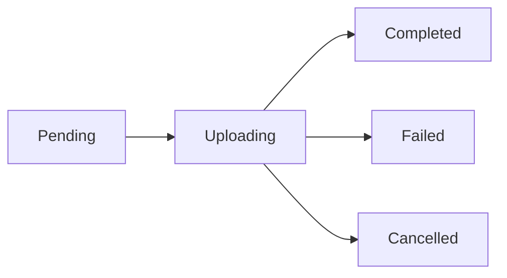

## Upload Methods

r2Vault supports three ways to upload files to your R2 bucket:

<CardGroup cols={3}>
  <Card title="Drag & Drop" icon="hand-pointer">
    Drop files from Finder directly into the browser window
  </Card>
  
  <Card title="File Picker" icon="file-circle-plus">
    Click the **+** button and choose **Upload Files…**
  </Card>
  
  <Card title="Menu Bar Widget" icon="bars">
    Drop files into the menu bar drop zone for instant upload
  </Card>
</CardGroup>

## Drag-and-Drop from Finder

The fastest way to upload files:

<Steps>
  <Step title="Select files in Finder">
    Choose one or more files (or an entire folder)
  </Step>
  
  <Step title="Drag to r2Vault">
    Drop them anywhere in the browser window. A blue overlay appears when the drop zone is active.
  </Step>
  
  <Step title="Upload begins">
    Files are queued and uploaded concurrently with live progress.
  </Step>
</Steps>

<Info>
  Files are uploaded to the **current folder** shown in the breadcrumb path. Navigate to a folder first to upload files there.
</Info>

### Folder Uploads

Dragging a folder recursively enumerates all files and preserves the folder structure:

```
Drop: vacation/
  ├── photos/
  │   ├── beach.jpg
  │   └── sunset.png
  └── videos/
      └── drone.mp4

Uploaded as:
  vacation/photos/beach.jpg
  vacation/photos/sunset.png
  vacation/videos/drone.mp4
```

Source: `AppViewModel.swift:360-420` (source: `Fiaxe/ViewModels/AppViewModel.swift:360-420`)

## Upload Files Button

Use the toolbar button for more control:

<Steps>
  <Step title="Click the + button">
    Opens the upload menu with options:
    - **Upload Files…**
    - **Upload Folder…**
    - **New Folder…**
  </Step>
  
  <Step title="Choose Upload Files…">
    Opens the macOS file picker
  </Step>
  
  <Step title="Select files">
    Choose one or more files. Press `⌘A` to select all, or `⌘-click` for multi-select.
  </Step>
  
  <Step title="Confirm">
    Click **Open** to start the upload
  </Step>
</Steps>

<Tip>
  The file picker uses **security-scoped bookmarks** to preserve access to files even after the picker closes, enabling background uploads.
</Tip>

Implementation: `AppViewModel.swift:458-469` (source: `Fiaxe/ViewModels/AppViewModel.swift:458-469`)

## Concurrent Uploads with Progress

Uploads run in parallel for maximum speed:

### Queue Behavior

- Up to **multiple files** upload simultaneously
- Each upload has its own progress bar
- Queue updates in real-time as files complete
- Failed uploads stay in the queue for review

### Progress Display

<Tabs>
  <Tab title="Main Window">
    The browser refreshes automatically when uploads complete, showing newly added files.
  </Tab>
  
  <Tab title="Menu Bar Widget">
    Displays:
    - Live count: "Uploading 2 of 5…"
    - Per-file progress bars (0-100%)
    - Pending status ("Waiting")
    - **Cancel All** button
  </Tab>
</Tabs>

Source: `MenuBarView.swift:188-221` (source: `Fiaxe/Views/MenuBarView.swift:188-221`)

### Upload Lifecycle



| Status | Description |
|--------|-------------|
| **Pending** | Queued, waiting for an available slot |
| **Uploading** | Active transfer with live progress |
| **Completed** | Successfully uploaded to R2 |
| **Failed** | HTTP error or network issue |
| **Cancelled** | User cancelled via Cancel button |

Source: `UploadTask.swift:23-29` (source: `Fiaxe/Models/UploadTask.swift:23-29`)

## Canceling Uploads

Stop uploads in progress:

<AccordionGroup>
  <Accordion title="Cancel individual files" icon="circle-xmark">
    From the menu bar widget, click the **×** button next to any uploading file.
  </Accordion>
  
  <Accordion title="Cancel all uploads" icon="ban">
    Click **Cancel All** in the menu bar upload progress section.
  </Accordion>
</AccordionGroup>

<Warning>
  Cancelled uploads are **not retried automatically**. Partially uploaded data may remain in R2 until the object is completed or manually deleted.
</Warning>

Cancellation implementation: `UploadTask.swift:41-45` (source: `Fiaxe/Models/UploadTask.swift:41-45`)

## Auto-Copy Public URL to Clipboard

When an upload completes successfully:

<Steps>
  <Step title="Upload finishes">
    File is written to R2 and appears in the browser
  </Step>
  
  <Step title="URL generated">
    r2Vault constructs the public URL:
    - Uses **custom domain** if configured
    - Falls back to R2 endpoint: `https://<account>.r2.cloudflarestorage.com/<bucket>/<key>`
  </Step>
  
  <Step title="Clipboard copy">
    URL is **automatically copied** to the system clipboard
  </Step>
  
  <Step title="Toast notification">
    A green toast appears in the menu bar:
    
    ```
    ✓ Link copied!
    photo.jpg
    ```
  </Step>
</Steps>

<Check>
  No extra clicks needed — paste the URL immediately into your browser, Slack, or anywhere else!
</Check>

Source: `AppViewModel.swift:559-578` (source: `Fiaxe/ViewModels/AppViewModel.swift:559-578`)

### Custom Domain URLs

If you've configured a custom domain in [Settings](/guide/configuration):

```diff
- https://abc123.r2.cloudflarestorage.com/my-bucket/photo.jpg
+ https://cdn.example.com/photo.jpg
```

The custom domain URL is used for:
- Clipboard auto-copy
- Upload history
- "Copy URL" context menu action

Implementation: `R2Credentials.swift:36-45` (source: `Fiaxe/Models/R2Credentials.swift:36-45`)

## Upload Service Details

Uploads use the **S3-compatible PUT API** with AWS Signature Version 4:

<AccordionGroup>
  <Accordion title="Request Details" icon="code">
    - **Method**: `PUT`
    - **Endpoint**: `https://<account>.r2.cloudflarestorage.com/<bucket>/<key>`
    - **Headers**:
      - `Content-Type`: MIME type (auto-detected from file extension)
      - `Content-Length`: File size in bytes
      - `Authorization`: AWS4-HMAC-SHA256 signature
  </Accordion>
  
  <Accordion title="Progress Tracking" icon="chart-line">
    Uses `URLSessionTaskDelegate` to receive real-time byte counts:
    
    ```swift
    func urlSession(
        _ session: URLSession,
        task: URLSessionTask,
        didSendBodyData bytesSent: Int64,
        totalBytesSent: Int64,
        totalBytesExpectedToSend: Int64
    )
    ```
    
    Progress is calculated as `totalBytesSent / totalBytesExpectedToSend`.
  </Accordion>
  
  <Accordion title="Error Handling" icon="triangle-exclamation">
    Uploads fail if:
    - HTTP status code is not `2xx`
    - Network connection is lost
    - Task is cancelled by user
    - File permissions prevent reading
    
    Error messages are displayed in the upload queue.
  </Accordion>
</AccordionGroup>

Source: `R2UploadService.swift:19-50` (source: `Fiaxe/Services/R2UploadService.swift:19-50`)

## Next Steps

<CardGroup cols={2}>
  <Card title="Menu Bar Widget" icon="bars" href="/guide/menu-bar">
    Use the menu bar for quick uploads and progress tracking
  </Card>
  <Card title="Managing Files" icon="folder-tree" href="/guide/managing-files">
    Create folders, delete files, and generate presigned URLs
  </Card>
</CardGroup>